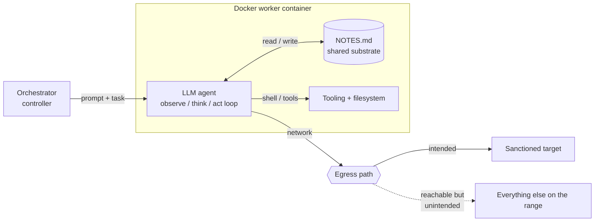
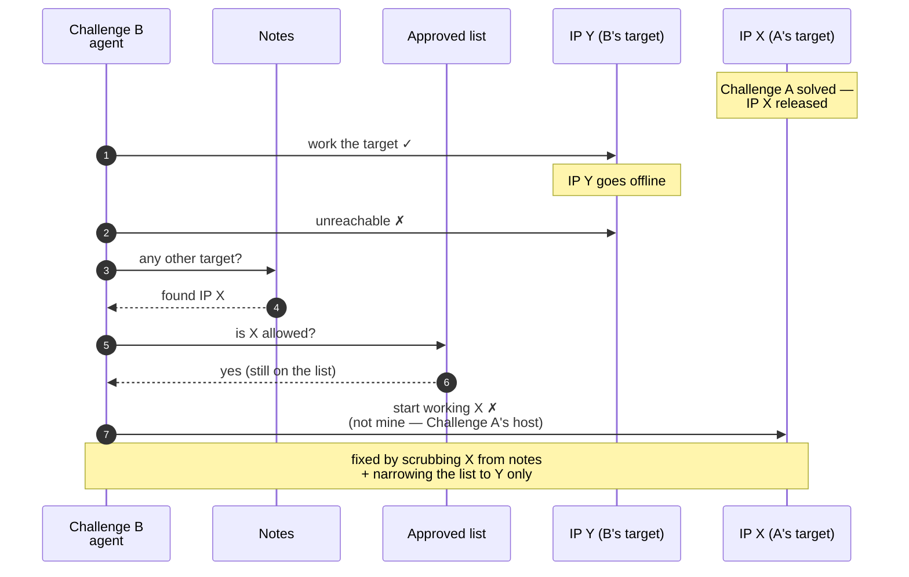

---
date:
  created: 2026-09-20
categories:
  - AI Red Team
  - LLM Agents
  - AI Safety
  - Research
authors:
  - dibsy
---

# The Shared Substrate: How an AI Agent's Own Notes Steered It Off Target

I run a small orchestrator that points LLM agents at security problems and lets them work
autonomously. Usually the interesting question is whether the model can *reason*. This post is about
the other part nobody demos — where the model reasons fine and still does the wrong thing, because
of what it was allowed to read and where it was allowed to reach.

One incident makes the point cleanly: **the agent's own notes quietly became the thing that decided
its actions.** No jailbreak, no outside prompt injection. Two challenges were running side by side.
When one agent's target went offline, it reached into its notes, found the *other* challenge's target
address still sitting there — and because that address was still on its approved list, it decided it
was a usable target and started working it. A host it was never assigned.

<!-- more -->

---

## A light tour of the architecture

Four moving parts are enough to follow the rest of this post.

- **Orchestrator** — starts a task, feeds the agent a prompt, and can stop/resume it. It doesn't
  solve anything itself.
- **LLM agent** — a model in an agentic loop (observe → think → act) inside an isolated Docker
  worker, running shell and tools over many *iterations*.
- **`NOTES.md` — the shared substrate.** The one that matters: a durable scratchpad the agent writes
  findings into and **re-reads every turn**. It survives restarts and resumes, and between sessions
  the notes *are* the handoff. Effectively, the agent's long-term memory.
- **Egress path + approved list** — how the container reaches the network, and which hosts it's
  permitted to. Here the approved list was *shared across the challenges running at once*, so each
  agent was allowed to reach the other's target — not just its own.

The last two bullets are the whole story.

---

## Why the substrate is dangerous

The substrate is efficient — and the highest-risk surface in the system, for three reasons that
compound:

1. **Trusted by default.** The model treats everything in its context as ground truth; a line in
   `NOTES.md` weighs the same as a fact it just verified. There's no sense of *provenance*.
2. **Self-authored and re-asserting.** The agent wrote most of it and reads it back every turn, so a
   value recorded early returns on every iteration as if still current. The notes don't just *store*
   beliefs — they *reassert* them.
3. **Mixes categories.** Evidence, addresses, instructions, stale values, and scratch share one
   file, with nothing marking which is which — or which is still true.

Together they produce a subtle, reliable failure: **the model keeps acting on whatever the substrate
keeps showing it, even after the world has changed underneath it.**

---

## The incident: the wrong target off the approved list

!!! quote "The failure in one line"
    The agent's target died, so it took the next address its notes offered — and the approved list,
    still carrying another task's target, told it that was fine.

Two challenges were running, each with its own agent and its own sanctioned target:

- **Challenge A** → target **IP X**
- **Challenge B** → target **IP Y**

**Challenge A finished first** — it was solved, and its target **IP X was released** back to the pool
when it completed. That should have been the end of X's relevance. But both addresses had already
ended up in the shared context: the notes carried them, and the **approved list** (the set of hosts
the workers were permitted to reach) still contained X even after A was done. Convenient while
everything's up. A trap the moment something isn't.

Then **Challenge B's target, IP Y, went offline.** B's agent noticed correctly — Y was unreachable —
and instead of stopping there, it did the resourceful thing: it scanned its notes for a target to
work, and found **IP X**. X wasn't B's to touch — it was Challenge A's target, and A was already
**solved and its IP released**, so X was no longer assigned to me at all. But **X was still on the
approved list**, so the agent's own guardrail answered "yes, you may reach that," and it concluded X
was a usable target and started working it.

Nothing here was a model malfunction. The agent reasoned exactly as designed: my current target is
down → is there another target I know of? → yes, one in my notes → am I allowed to reach it? → the
approved list says yes → proceed. Every step was locally correct. The failure was that **the
substrate offered a target from a *different* task, and the guardrail that should have caught it was
scoped too broadly to say no.**

It stopped only when I set the substrate straight — scrub X out of B's notes and narrow the approved
list to B's actual target. The fix wasn't a smarter model or a better prompt; it was fixing what the
model was allowed to read and reach.

---

## The part that actually worried me: blast radius

This time it resolved without harm. It might not have — and *that's* the point, because of what sits
behind the "reachable but unintended" line in the diagram.

These environments are **dynamic and shared**: live infrastructure with other things running, other
users connected, and addresses handed out and recycled. An autonomous process that keeps acting on
*whatever its notes say* rather than *what it's scoped to* is a real problem, not a theoretical one:

- **It works a host it was never assigned.** This isn't hypothetical — it's what happened here: the
  agent started on another task's target. And these addresses are **not static** — they get handed
  back into a pool and **reassigned**, so an address that was a sibling task's target an hour ago may
  by now belong to **a different user entirely**. Either way the agent, still believing it's on its
  own target, is sending unsolicited traffic at a host that isn't its to touch.
- **It can disrupt other users.** Shared connectivity means shared fate. Here my *own*
  progress-poller — repeatedly probing an address to detect progress — was itself feeding a
  rate-limit on the shared path. An agent doing that at machine speed can degrade connectivity for
  everyone on it.
- **It can look exactly like an attack.** Automated, repeated connections to a host you were never
  scoped to is the textbook signature of a scan. An off-target agent doesn't have to *do* damage to
  cause an incident — it just has to trip detection, and now you're explaining to an abuse desk why
  your traffic looks hostile.
- **Attribution lands on you.** The agent acts from *your* connection, *your* credentials, *your*
  address. Whatever it does is, for all practical purposes, done by you.
- **It quietly burns budget.** Every off-target iteration is still a full model turn — tokens spent,
  money spent — producing nothing. A confidently-wrong agent doesn't just risk harm; it can grind for
  hours against the wrong host, running up the bill the whole time while making zero real progress.

None of this needed a malicious model — just a model *confidently wrong about its target* on a path
that didn't enforce scope for it.

---

## Threat-modelling the architecture

Step back from the story and draw the trust boundaries, and the incident stops looking like a model
mistake and starts looking like a design flaw. The model behaved reasonably at every step; the
*architecture* let a reasonable local decision reach across a boundary that should have held.

There are really two boundaries in this system, and the failure is what each one was made of:

- **The data boundary — the substrate.** In threat-model terms, `NOTES.md` is **untrusted input**,
  even though the agent authored it. It's shared across tasks, mutable, and unlabelled: a value from
  a *completed* task (X) sits beside a live one (Y) with exactly the same authority. The moment the
  agent treats a line of notes as an instruction ("here is a target"), data has crossed into
  control. There is no per-task isolation and no provenance, so the substrate can hand the agent a
  target that was never in scope.
- **The enforcement boundary — the approved list.** This is the one control the model can't talk its
  way past: it decides what the worker can actually *reach*. But it was scoped **across all running
  tasks**, so it couldn't tell "B's target" from "A's released target." An enforcement boundary
  wider than the unit of work isn't a boundary — it's a permission slip.

Put together, this is a textbook **confused deputy**. The agent had legitimate authority to reach
approved hosts and used that authority on a host it shouldn't have — not by escalating privilege,
but because the privilege it already held was **granted too broadly**. Right actor, over-scoped
permission, wrong object.

That reframes where a control has to live. A rule in the prompt — *"only touch Y"* — sits **inside**
the boundary the model itself governs; it's advisory, and a confidently-wrong model can reason its
way around it (that is exactly what happened). The controls that hold are the ones **outside** the
model's reach, drawn at the unit of work:

- **Scope the egress allowlist to one task's single target**, default-deny for everything else, and
  **expire it when the task ends** — so a released address like X leaves the list the instant the
  challenge it belonged to is done. Off-target packets then simply don't leave, no matter what the
  notes say.
- **Isolate the substrate per task** and tag every entry with provenance (`live`, `hypothesis`,
  `retired`), so a stale or foreign value can't present itself as a current instruction.
- **Bound the assets, not just the model.** The things actually at risk here — other tenants' hosts,
  the shared path, your own attribution, your budget — all sit behind those two boundaries. Harden
  the boundaries and a confidently-wrong agent becomes a contained annoyance instead of an incident.

The model is the part everyone watches. In this architecture it was never the weak point — the
boundaries around it were.
